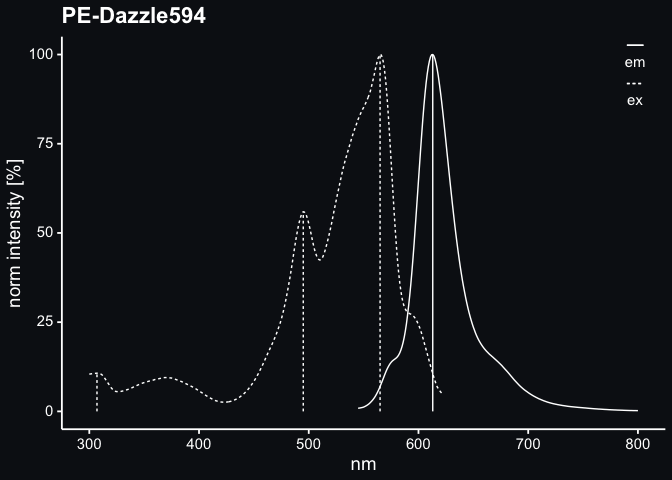

<!-- README.md is generated from README.Rmd. Please edit that file -->

# much\_fluorescent

<!-- badges: start -->
<!-- badges: end -->

A small repository for spectral data of happy little fluorochromes.

<!-- -->

See plots of excitation and emission spectra in spectra_images.

All raw data for those are in spectra.tsv.gz and em_ex_maxima.tsv.

    #> 
    #> 
    #> |fluorochrome |  nm|   em|    ex|
    #> |:------------|---:|----:|-----:|
    #> |PE-Dazzle594 | 545| 0.87| 81.85|
    #> |PE-Dazzle594 | 546| 0.92| 82.57|
    #> |PE-Dazzle594 | 547| 0.97| 83.29|
    #> |PE-Dazzle594 | 548| 1.04| 83.97|
    #> |PE-Dazzle594 | 549| 1.11| 84.61|
    #> |PE-Dazzle594 | 550| 1.20| 85.16|
    #> |PE-Dazzle594 | 551| 1.35| 85.80|
    #> |PE-Dazzle594 | 552| 1.51| 86.46|
    #> |PE-Dazzle594 | 553| 1.69| 87.12|
    #> |PE-Dazzle594 | 554| 1.90| 87.91|
    #> 
    #> 
    #> |fluorochrome |type |  nm| norm_intensity|
    #> |:------------|:----|---:|--------------:|
    #> |PE-Dazzle594 |em   | 613|            100|
    #> |PE-Dazzle594 |ex   | 307|             11|
    #> |PE-Dazzle594 |ex   | 495|             56|
    #> |PE-Dazzle594 |ex   | 565|            100|

Peaks were detected by algorithm. This may either be oversensitive and
detect too many of them or miss some. Plots were checked and only very
few minor peaks are not detected. In very few spectra lowest emission
peak is below lowest excitation which should not be according to [Stokes
shift](https://en.wikipedia.org/wiki/Stokes_shift). Some spectra include
negative values or values above 100 which is weird but data was left as
obtained in this case. However, leading and trailing zeros were removed
for instance.
